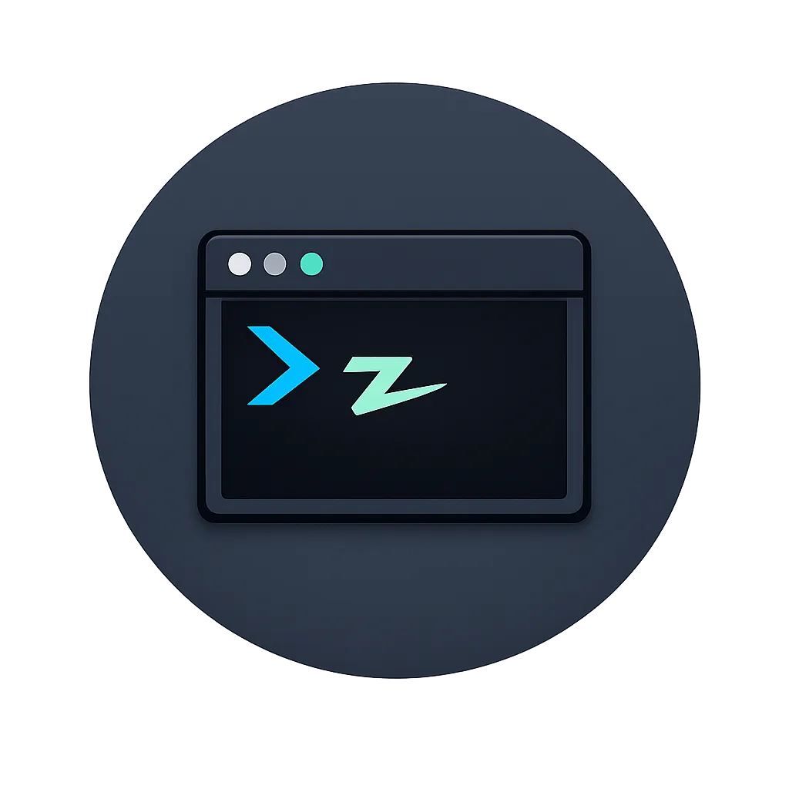

# ZDOTFILES

A compact zsh setup for macOS. [Antidote](https://github.com/mattmc3/antidote)
manages the plugins, [Starship](https://starship.rs) draws the prompt, and a
single `zshrc.sh` drives everything.

<p align="center">
  
</p>

## Install

### Automatic

Paste this into a terminal:

```sh
git clone https://github.com/jcyamacho/zdotfiles.git "$HOME/.zdotfiles" &&
  printf '%s\n%s\n' 'source "${ZDOTFILES_DIR:-$HOME/.zdotfiles}/zshrc.sh"' \
    "$(cat ~/.zshrc 2>/dev/null)" > ~/.zshrc &&
  exec zsh
```

It clones the repo to `~/.zdotfiles`, adds the line that loads it to the top of
your `~/.zshrc`, and starts a new shell. If `~/.zdotfiles` already exists, the
clone fails and `~/.zshrc` is left unchanged.

### Manual

1. Clone the repo:

   ```sh
   git clone https://github.com/jcyamacho/zdotfiles.git "$HOME/.zdotfiles"
   ```

2. Source the main file from your `~/.zshrc`:

   ```sh
   source "${ZDOTFILES_DIR:-$HOME/.zdotfiles}/zshrc.sh"
   ```

### After Installing

On first load, zdotfiles installs Homebrew and Starship if they are missing.
Every other tool is opt-in through an `install-*` command (see
[Installable Tools](#installable-tools)).

## Customizing

Set these variables in `~/.zshrc`, before the `source` line:

| Variable | Default | Controls |
| --- | --- | --- |
| `ZDOTFILES_DIR` | `~/.zdotfiles` | Repository location |
| `ZDOTFILES_CACHE_DIR` | `${XDG_CACHE_HOME:-~/.cache}/zdotfiles` | Cached tool init scripts and completions |
| `CUSTOM_TOOLS_DIR` | `~/.local/bin` | Install location of self-managed tools |
| `EDITOR` | `zed --wait` with Zed installed, otherwise `vim` | Editor for `edit`, `zsh-config`, and the `*-config` helpers |
| `GIT_WORKTREE_BASE` | Parent directory of the main worktree | Where `gwt` creates worktrees ([git-worktree](plugins/git-worktree/README.md)) |
| `STARSHIP_CONFIG` | `~/.config/starship.toml` | Starship configuration file |
| `ZSH_DISABLE_YOU_SHOULD_USE` | Unset | Any value turns off alias reminders |

For example, to turn off the
[zsh-you-should-use](https://github.com/MichaelAquilina/zsh-you-should-use)
reminders that appear when you type a command that has an alias:

```sh
# ~/.zshrc
export ZSH_DISABLE_YOU_SHOULD_USE=1
source "${ZDOTFILES_DIR:-$HOME/.zdotfiles}/zshrc.sh"
```

### Starship

- `update-starship`: update Starship and reload the shell.
- `starship-config`: edit the active configuration and reload the shell.
- `starship-preset-custom`: apply this repo's [`starship.toml`](starship.toml).
- `starship-preset-nerd-fonts`, `starship-preset-no-nerd-font`, and
  `starship-preset-plain-text`: apply a built-in Starship preset.

## Plugins

zdotfiles always loads `zsh-autosuggestions`, `fast-syntax-highlighting`, and
`zsh-you-should-use`, plus `fzf-tab` when fzf is installed.

The commands for each tool, such as its `*-config` helper or `uninstall-*`,
become available once the tool is installed.

## Installable Tools

Each `install-*` command installs a tool. Its integration loads on `reload` or
in the next shell.

### Recommended

These tools are not installed by default. Run `install-recommended` to install
every missing one.

- `install-atuin`: [Atuin](https://atuin.sh/) synced, searchable history
- `install-carapace`: [Carapace](https://carapace.sh/) multi-shell completions
- `install-fzf`: [fzf](https://junegunn.github.io/fzf/) fuzzy finder, which
  also enables `fzf-tab`
- `install-jq`: [jq](https://jqlang.org/) command-line JSON processor
- `install-yazi`: [yazi](https://yazi-rs.github.io/) terminal file manager;
  `y` or `Ctrl+o` opens it and changes to its directory on exit
  ([yazi plugin](plugins/yazi/README.md))
- `install-zoxide` (or `install-z`): [zoxide](https://github.com/ajeetdsouza/zoxide)
  smarter `cd`

### Optional

- `install-agent-browser`: [agent-browser](https://agent-browser.dev/) browser
  automation for AI agents
- `install-antigravity`: [Antigravity](https://antigravity.google/) AI editor
- `install-aspire`: [Aspire](https://aspire.dev/) CLI for distributed apps
- `install-bash`: [Bash](https://www.gnu.org/software/bash/) current release
  from Homebrew (macOS ships 3.2)
- `install-bat`: [bat](https://github.com/sharkdp/bat) `cat` clone
- `install-btop`: [btop](https://github.com/aristocratos/btop) resource monitor
- `install-bun`: [Bun](https://bun.sh/) JavaScript runtime
- `install-claude-code`: [Claude Code](https://www.anthropic.com/claude-code)
  coding agent
- `install-cmux`: [cmux](https://www.cmux.dev/) native macOS terminal for AI
  agents
- `install-code`: [VS Code](https://code.visualstudio.com/) editor
- `install-codex`: [OpenAI Codex CLI](https://developers.openai.com/codex/cli)
  ([codex plugin](plugins/codex/README.md))
- `install-copilot`: [GitHub Copilot CLI](https://github.com/features/copilot/cli/)
- `install-cursor`: [Cursor](https://www.cursor.com/) editor
- `install-cursor-cli`: [Cursor CLI](https://cursor.com/docs/cli/installation)
  terminal agent, through its native installer in `~/.local/bin`.
  `update-cursor-cli` updates it, also through `update-all`, and
  `uninstall-cursor-cli` removes it.
- `install-deno`: [Deno](https://deno.land/) JavaScript runtime
- `install-direnv`: [direnv](https://direnv.net/) per-directory environment
  variables ([direnv plugin](plugins/direnv/README.md))
- `install-docker`: [Docker](https://www.docker.com/) CLI
- `install-dotenvx`: [dotenvx](https://github.com/dotenvx/dotenvx) encrypted
  dotenv files
- `install-dotnet`: [.NET SDK](https://dotnet.microsoft.com/)
  ([dotnet plugin](plugins/dotnet/README.md))
- `install-fabric`: [Fabric](https://github.com/danielmiessler/fabric) AI
  prompt framework
- `install-flutter`: [Flutter](https://flutter.dev/) SDK
- `install-fonts`: Monaspace, Hack Nerd Font, and JetBrains Mono and Fira Code
  with their Nerd Font variants, as Homebrew casks
- `install-gemini`: [Gemini CLI](https://github.com/google/gemini-cli)
- `install-gh`: [GitHub CLI](https://github.com/cli/cli), plus gist sync helpers
  ([github-cli plugin](plugins/github-cli/README.md))
- `install-ghostty`: [Ghostty](https://ghostty.org/) terminal with its config
  ([ghostty plugin](plugins/ghostty/README.md))
- `install-go`: [Go](https://golang.org/) and
  [golangci-lint](https://golangci-lint.run/)
  ([golang plugin](plugins/golang/README.md))
- `install-gradle` and `install-maven`: [Gradle](https://gradle.org/) and
  [Maven](https://maven.apache.org/) official binary distributions, using the
  existing JDK ([java plugin](plugins/java/README.md))
- `install-herdr`: [Herdr](https://herdr.dev/) agent multiplexer for the
  terminal
- `install-java-25` and `install-java-21`:
  [Amazon Corretto](https://aws.amazon.com/corretto/) LTS JDKs through
  Homebrew. When `JAVA_HOME` is unset, the newest installed JDK is selected
  (25, then 21). `uninstall-java-25` and `uninstall-java-21` remove them, and
  `update-brew` applies patch updates ([java plugin](plugins/java/README.md)).
- `install-just`: [just](https://just.systems/) command runner
- `install-lsd`: [lsd](https://github.com/lsd-rs/lsd) `ls` alternative, with a
  config and color theme
- `install-memo`: [memo](https://github.com/jcyamacho/memo) durable memory CLI.
  Configure agent hooks with `memo hook claude` or `memo hook codex`.
- `install-mise`: [mise](https://mise.jdx.dev/) dev tools, environment
  variables, and task runner
- `install-nub`: [Nub](https://nubjs.com/) all-in-one Node.js toolkit
- `install-ollama`: [Ollama](https://ollama.com/) local LLM runner
- `install-opencode`: [OpenCode](https://opencode.ai/) terminal coding agent
- `install-openspec`: [OpenSpec](https://openspec.dev/) workflow CLI
  ([openspec plugin](plugins/openspec/README.md))
- `install-orbstack`: [OrbStack](https://orbstack.dev/) Docker Desktop
  alternative
- `install-orca`: [Orca](https://www.onorca.dev/) desktop IDE for running coding
  agents in parallel worktrees
- `install-pi`: [Pi](https://pi.dev/) minimal terminal coding harness
- `install-rbenv` (or `install-ruby`): [rbenv](https://github.com/rbenv/rbenv)
  Ruby version manager
- `install-rust`: [Rust](https://www.rust-lang.org/) toolchain through rustup
- `install-television`:
  [Television](https://alexpasmantier.github.io/television/) fuzzy finder.
  It binds `Ctrl+T` to channel-aware completion (`Ctrl+R` stays with Atuin when
  installed) and also installs `fd` and `bat`, which its channels use.
- `install-uv` (or `install-python`): [uv](https://docs.astral.sh/uv/) and
  Python tooling ([python plugin](plugins/python/README.md))
- `install-varlock`: [varlock](https://varlock.dev/) AI-safe `.env` files
- `install-viteplus` (or `install-node`): [Vite+](https://viteplus.dev/) web
  toolchain and Node.js version manager. `install-node` also works when Vite+
  is already installed.
  - `update-node` installs the latest Node.js LTS, makes it the global default,
    activates it in the current shell, and updates npm and pnpm through Vite+.
    It also runs through `update-all`.
  - pnpm comes from Vite+ instead of Corepack, with a global default and
    per-project versions. Bun stays independently managed.
  - `uninstall-unused-node-versions` removes Vite+ Node.js installations other
    than the current and default versions.
  - When switching from fnm, open a new terminal and run `update-node` once to
    enable Vite+ management. Existing fnm installations are not deleted.
- `install-wezterm`: [WezTerm](https://wezterm.org/) terminal with its config
  ([wezterm plugin](plugins/wezterm/README.md))
- `install-worktrunk`: [Worktrunk](https://worktrunk.dev) git worktree
  management ([worktrunk plugin](plugins/worktrunk/README.md))
- `install-zed`: [Zed](https://zed.dev/) editor
- `install-zellij`: [Zellij](https://zellij.dev/) terminal workspace
  ([zellij plugin](plugins/zellij/README.md))
- `install-zig`: [Zig](https://ziglang.org/) programming language
- `install-zsh-bench`: [zsh-bench](https://github.com/romkatv/zsh-bench)
  benchmark for interactive zsh

## Utility Plugins

These plugins add helper functions and need no external tool:

- [git](plugins/git/README.md): `g`, `gaa`, `gf`, `gcb`, `gcmsg`, `gc!`, `ggl`,
  and `ggp` shorthands, plus `git-pull-all` and `git-hook`
- [git-worktree](plugins/git-worktree/README.md): `gwt` commands to create,
  switch, and remove Git worktrees
- [dotenv](plugins/dotenv.zsh): `dotenv [-e environment] [--] command [args...]`
  runs a command with variables from env files in the current directory,
  without changing your shell.
  - It loads `.env` and `.env.local`, then, with `-e`, `.env.<environment>` and
    `.env.<environment>.local`. Missing files are skipped. Later values
    override earlier ones and inherited environment variables.
  - Files accept `KEY=value`, an optional `export`, blank lines, comments, and
    LF or CRLF endings. Keys use letters, digits, and underscores and cannot
    start with a digit.
  - Surrounding whitespace is ignored, and outer single or double quotes are
    removed. An inline comment needs whitespace before `#`; a `#` inside quotes
    or attached to a value is literal.
  - Values are literal: variables, command substitutions, backticks, and
    escapes are never expanded. Multiline values and concatenated quoted
    fragments are not supported.
  - An invalid or unreadable file stops the command before it runs. The error
    shows only the file and line, never values. Loaded variables can still
    affect the command's behavior.
  - Examples: `dotenv -- bun run dev` or
    `dotenv -e production -- bun run start`.

## Utility Functions

Shell helpers from `_utils.zsh`:

- `mkcd <dir>`: create a directory and `cd` into it.
- `edit <file>`: open a file in `$EDITOR`.
- `home`: `cd` to `$HOME`.
- `zsh-config`: edit `~/.zshrc` and reload it.
- `kill-port <port>`: stop the process listening on a TCP port, forcing it if
  it does not exit.
- `zsh-plugins-regenerate`: rebuild the Antidote plugin bundle and reload.
- `zdotfiles-cache-clean`: delete all zdotfiles caches, after confirmation, and
  reload.
- `cls`, `rmf`, and `cd..`: aliases for `clear`, `rm -rf`, and `cd ..`.

## Gist Sync

`save-file-to-gist` and `load-file-from-gist` sync individual files with
secret GitHub gists. See the [github-cli plugin](plugins/github-cli/README.md)
for details.

## Updating

- `reload`: reload zdotfiles.
- `reload-full`: reload `~/.zshrc`, including your own settings in it.
- `update-zdotfiles`: pull the latest repo changes (fast-forward only) and
  reload.
- `update-antidote`: update Antidote and its plugins, then reload.
- `update-brew`: update Homebrew and upgrade every formula and cask
  (`--greedy`), which covers most tools installed by zdotfiles, then clean up
  and reload.
- `update-all`: update everything at once (the repo, Antidote, Homebrew,
  Starship, and the extra updates of installed tools, such as Node.js versions
  or Ollama models), then reload.

## Performance

- `zsh-startup-bench`: time 10 shell startups. Run it before and after a change.
- `zsh-startup-profile`: profile one startup with zprof.
- `zsh -lic exit`: check that a full startup works without opening a new
  terminal.
- For input latency rather than startup time, use zsh-bench
  (`install-zsh-bench`).
